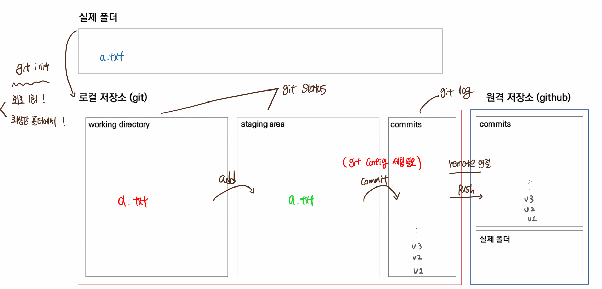

# Git 기초

## 1. Git 초기 설정

- **최초 1번만 진행**
- 누가 이 버전을 기록했는지에 대한 정보를 등록하고 시작

```bash
$ git init
Initialized empty Git repository in C:/Users/eduju.JUSTIN-DESKTOP/Desktop/TIL/.git/
```


## 2. Git 기본 명령어 

### 2.1. Git 초기화

- 해당 디렉토리는 git이 버전 관리할 수 있도록 하는 명령어

- 해당하는 폴더에 `.git` 이라는 숨긴 폴더가 생김
- `master`라고 하는 사인이 우측에 나타남

```bash
$ git init
Initialized empty Git repository in C:/Users/eduju.JUSTIN-DESKTOP/ssafy7/TIL/.git/
```


```bash
$ git commit -m "test1.txt 파일을 생성했음"
Author identity unknown

# 당신이 누군지 알려주세요
*** Please tell me who you are.

# 아래와 같은 명령어를 수행하세요.
Run
  # 딱 1번만 아래 2개 명령어를 실행하면 됨
  git config --global user.email "you@example.com"      
  git config --global user.name "Your Name"

to set your account's default identity.
Omit --global to set the identity only in this repository.

fatal: unable to auto-detect email address (got 'eduju@justin.(none)')
```


세팅 확인하는 방법

```bash
$ git config --global --list
user.email=edujustin.hphk@gmail.com
user.name=justin kim
```


###  2.2  git status

- Working Directory / Staging Area의 상태를 확인하는 명령어
- 습관적으로 사용해야 하는 명령어
- 빨간색
  - WD
- 초록색
  - SA

```bash
# add 전 상태
$ git status
On branch master

No commits yet

Untracked files:
  (use "git add <file>..." to include in what will be committed)
        test1.txt

nothing added to commit but untracked files present (use "git add" to track) 

# add 후 상태
$ git status
On branch master

No commits yet

Changes to be committed:
  (use "git rm --cached <file>..." to unstage)
        new file:   test1.txt
        
# commit 이후의 상태 -> 버전으로 남길 것이 더이상 없음
$ git status
On branch master
nothing to commit, working tree clean
```


### 2.3 git add

- working directory -> staging area로 이동 시키는 명령어
- commit을 수행하기 위한 준비 단계

```bash
$ git add test1.txt

$ git status
On branch master

No commits yet

Changes to be committed:
  (use "git rm --cached <file>..." to unstage)
        new file:   test1.txt
```


### 2.4  git commit 

- snapshot을 찍는 것 -> 현재 상태를 하나의 버전으로 남기는 것 
- 누가 / 어떤 것을 수정해서 버전으로 남겼는지 확인 가능

```bash
$ git commit -m "test1.txt라는 파일을 생성한 버전입니다."     
[master (root-commit) 0e8b3a0] test1.txt라는 파일을 생성한 버 
전입니다.
 1 file changed, 0 insertions(+), 0 deletions(-)
 create mode 100644 test1.txt
```


### 2.5  git log

- commit 메시지를 확인하는 명령어

```bash
$ git log
commit 0e8b3a016a1eb4cd08e365a61a59f1fb3ef4a17d (HEAD -> master)
Author: justin kim <edujustin.hphk@gmail.com>
Date:   Thu Jan 13 16:32:46 2022 +0900

    test1.txt라는 파일을 생성한 버전입니다.
```


### 2.6 git push

- 로컬 컴퓨터에서 git을 활용하여 버전 관리한 폴더를 github에 업로드 하는 것 
- 주의해야 할 것
  - 자동으로 동기화 되는 것이 아님 
  - commit 이라는 변경 사항에 대한 기록을 기반으로 동작


```bash
# git아 remote(원격저장소)를 add(추가)해줘 origin(별명으로) (이 주소에)

$ git remote add origin https://github.com/edujustin.hphk/TIL.git

[풀이]
git 명령어를 작성할건데, remote(원격 저장소)에 add(추가) 한다.
origin이라는 이름으로 https://github.com/edujustin.hphk/TIL.git라는 주소의 원격 저장소를
```

```bash
# 저장된 주소 확인

$ git remote -v
origin  https://github.com/edujustin.hphk/TIL.git
origin  https://github.com/edujustin.hphk/TIL.git


add를 이용해 추가했던 원격 저장소의 이름과 주소가 출력됩니다.
```

```bash
# origin(별명)이라는 곳에 master 브랜치를 push(업로드)

$ git push origin master
```





## 미션 - TIL (다시) 세팅하기 

> 오늘 배웠던 내용을 복습하는 차원으로 진행해보세요.😀 

1. TIL 이라는 폴더를 git이 관리하도록 세팅한다.
2. `README.md` 파일을 만든다. 
3. `README.md` (마크다운 문법을 활용) 파일에 이번 한 학기를 어떻게 보낼지 / TIL을 어떤 형태로 활용할지 등등에 대한 정보를 기입한다. 
4. add를 통해 commit을 준비한다.
5. commit을 통해 버전을 만든다.
6. github에서 `TIL` 이라는 이름의 원격 저장소를 만든다. 
7. 원격 저장소와 내 로컬 컴퓨터의 저장소를 연결한다.

8. push한다.
9. github `TIL`이라는 저장소에 잘 업로드 되었는지 확인한다.

